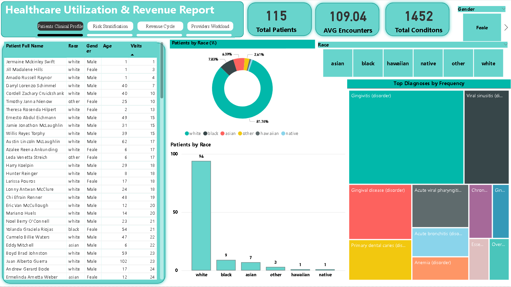
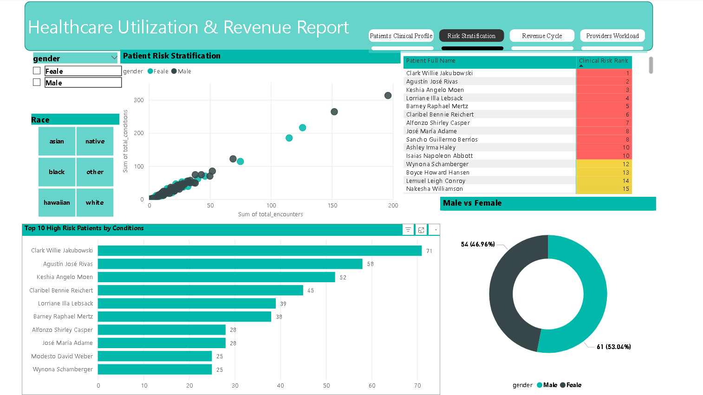
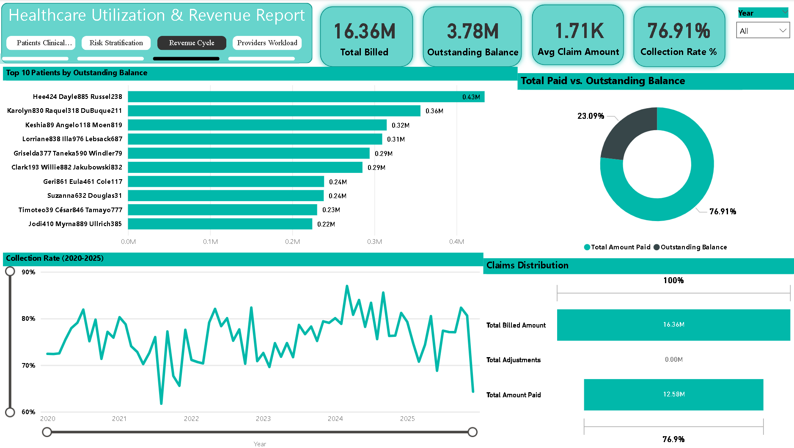
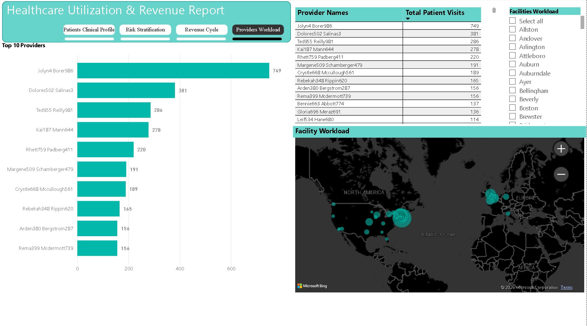

# Healthcare-Utilization-and-Revenue-Analysis

Welcome to my **Healthcare Utilization & Revenue Analysis** repository! 
Healthcare leaders are often drowning in data but starving for insights. This project bridges that gap. Using realistic synthetic data, 
I built a system that takes messy, disorganized spreadsheets and transforms them into a high-performance engine for decision-making.
The goal was simple: Create a "Single Source of Truth" to help leaders improve patient health, keep the organization financially healthy, 
and ensure operations run smoothly.

---

 ## 🛠️Project Tools:

- **Database:** PostgreSQL (Data Organization Model)  
- **Data Extraction & Analysis:** CTEs, Window Functions (RANK), Complex JOINs, and Data type casting.
- ### 📊 Key DAX Measures
*   **Collection Rate %**: `DIVIDE(SUM(paid), SUM(billed), 0)` – Tracks the 76.91% efficiency goal.
*   **Due Balance**: `SUM(billed) - SUM(paid)` – Identifies the $3.78M recovery roadmap.
*   **Patient Age**: `DATEDIFF(birth_date, TODAY(), YEAR)` – Powers the 360-Degree Clinical View.
- **Healthcare Operations Knowledge:** Including Revenue Cycle, Population Health, and Clinical Processes  

---

## 🏗️The Data Pipeline: From "Chaos" to "Clean"

Before you can trust a report, you have to trust the data. I designed a two-step "sorting" process to protect the integrity of the final results:
<h2 align="center">PostgreSQL ETL Pipeline</h2>

 

  

## 1. The Junk Drawer (Raw Schema)

I first pull the data exactly as it is. I ensure we don't lose any information just because a date was formatted strangely or a character was out of place.

## 2. The Clean Room (Analytics Schema)

This is where the magic happens. I cleaned the data using four strict rules:

- **Deduplication:** Using `SELECT DISTINCT` to ensure no patient or encounter is counted twice.  
- **Orphan Control:** Filtering child tables to ensure we don't have "ghost" records pointing to non-existent patients.  
- **Relational Integrity:** Enforcing Primary and Foreign Keys to connect the dots between patients and their claims.  
- **Performance:** Organizing the data so that complex questions get answered in seconds, not minutes.  

## 3. From PostgreSQL Database to Power BI using VIEW

For fast and efficient reporting process I created four individual VIEWs that acts as a window into our database, 
each is tailored to answer a specific business question.
By doing all the major filtering and organizing data inside the PostgreSQL database first, Power BI only has to pull exactly what it needs. 
This results in a much faster, more streamlined report that focuses on the key insights without being slowed down by unnecessary background information.

---

## 📊The Four Pillars of Insight

Once the data was polished, I built four specific queries to answer the most important questions in healthcare:

---

## 1. The 360-Degree Patient View

- **The Goal:** How do we see the whole person, not just a chart?  
- **The Result:** I merged demographics and medical history to create a complete story for every patient.
  This allows us to see how factors like age or race correlate with specific health outcomes, providing a "Single Source of Truth" for clinicians.

---

## 2. Patient Risk Forecasting

- **The Goal:** Which patients need our help the most?  
- **The Result:** I created a "risk score" by identifying patients with multiple chronic conditions.
  This helps care managers prioritize outreach for patients who are most at risk for hospital readmissions.

---

## 3. The Revenue Roadmap

- **The Goal:** Where is our missing revenue?  
- **The Result:** I built a financial health query that tracks the lifecycle of a medical claim from the initial bill to final payments.
  By isolating outstanding balances, I created a roadmap for the billing department to target unpaid claims and improve cash flow.

---

## 4. Provider Workload Analysis

- **The Goal:** Are our resources being used efficiently?  
- **The Result:** I analyzed how busy each doctor and clinic are. This shows exactly where we are overstretched and where we might need to hire more staff to reduce patient wait times.

---

## 🖥️ Dashboard Overview 
 **Patients Clinical Profile**
 

  

 **High Risk Patients**

  

**Revenue Analysis**

  

**Provider Workload**

  

---

## 📈Executive Insights

Analyzed 1,452 conditions across 115 high-complexity patients to drive these three strategic wins:
**Financial Recovery:** 
Identified $3.78M in Outstanding Balances. Targeting the Top 10 debtor accounts alone can 
recover $3M in immediate cash flow and stabilize volatile collection rates.
**Operational Risk:** 
Discovered a critical workload imbalance where one provider handles double the volume of others. 
Recommended redistributing visits to underutilized staff to prevent burnout and turnover.
**Clinical Strategy:** 
Isolated "Super-Utilizers" (600+ visits) and identified a 50-visit "tipping point" where patient 
complexity skyrockets, allowing for proactive, lower-cost interventions.

## 👉Read the full insight in the reports folder

---

## 🚀How to Run the Project

1. **Environment:** Set up a PostgreSQL database.  
2. **Schema Setup:** Run the `CREATE SCHEMA` scripts to establish the `raw` and `analytics` layers.  
3. **Data Load:** Use the `COPY` commands to import the Synthea CSVs into the `raw` schema.  
4. **Transformation:** Run the ETL scripts to deduplicate, cast data types, and enforce keys in the `analytics` schema.  

**Insights:** Navigate to the `/queries` folder to run the four analysis scripts described above.

---

## 💡Why This Approach Works

- **Safety First:** The original data is never touched. If we want to change our analysis later, we can "reset" without losing anything.  
- **Quality Control:** The system acts as a bouncer, automatically blocking bad or incomplete data from entering your final reports.  
- **Actionable Results:** We aren't just looking at numbers; we are looking at a roadmap to better patient care and a stronger bottom line.
